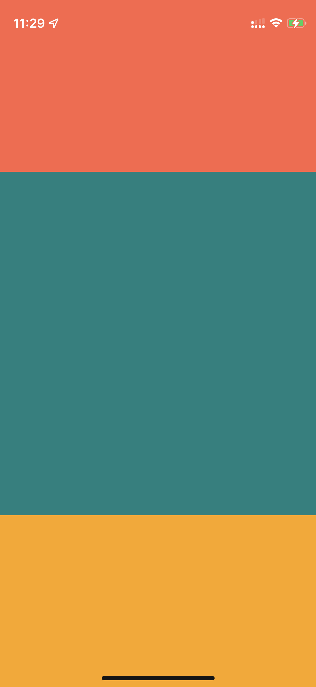

#

## Rules

1. div 못쓴다 -> View 써라
2. 문자열은 Text 컴포넌트 안에 써라
3. 스타일은 거의 쓸 수 있지만 조금 다르다. StyleSheet.create를 사용하면 자동완성이 지원된다. Rule 3 예제 참조


### Rule 3 예제

```js
import {StyleSheet} from "react-native";

const styles = StyleSheet.create({
  containers: {
    flex: 1,
    backgroundColor: "white",
    // border: "1px green dashed", 지원하지 않음
  },
});
```

## 레이아웃

1. 모든 View는 기본적으로 Flex 컨테이너 이며, 기본 디렉션은 Column이다.
2. overflow에 대해 기본적으로 스크롤을 지원하지 않는다.
3. 프로필 이미지 등을 제외하면 width, height 는 사용하지 않는다. flex 이용.

<div style="display: flex; column-gap: 5vw;">

  

  ```js
  import { View } from 'react-native';

  export default function App() {
    return (
      <View style={{ flex: 2 }}>
        <View style={{ flex: 1, backgroundColor: "tomato" }}></View>
        <View style={{ flex: 2, backgroundColor: "teal" }}></View>
        <View style={{ flex: 1, backgroundColor: "orange" }}></View>
      </View>
    );
  }
  ```
  
</div>


